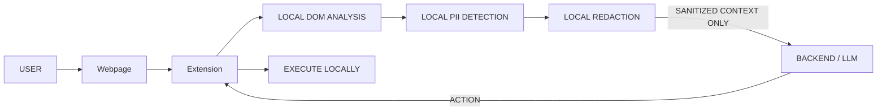

# 🛡️ Veli: Privacy-Preserving Visual Browser Agent

**🔗 Live Demo:** [https://veli-agent.vercel.app/](https://veli-agent.vercel.app/)


Veili is a Chrome MV3 extension combined with a FastAPI backend and a React dashboard. It ensures that the webpage is understood locally, Personally Identifiable Information (PII) is detected and redacted **inside the browser**, and **only sanitized context ever leaves the device**.

## ✨ How It Works



## 🏗️ Architecture Layers

| Layer | Code Path | Description |
| :--- | :--- | :--- |
| **Local Vision/DOM** | `extension/content/content.js` | Parses the DOM and understands the page structure. |
| **Local Privacy** | `extension/privacy/*` | Detects, redacts, and firewalls PII (`piiDetector.js`, `redactor.js`, `privacyFirewall.js`). |
| **Server Reasoning** | `backend/main.py`, `backend/agent.py` | Receives sanitized data, determines the next action using LLM. |
| **Local Action** | `extension/agent/actionExecutor.js` | Receives the action from the backend and executes it on the page. |

> **Note:** A local vision model (ONNX Runtime Web / Transformers.js / WebGPU) can later replace the DOM analysis step without touching the other three layers.

## 🚀 Getting Started

### 1. Run the Backend
Navigate to the backend folder and start the FastAPI server:

```bash
cd backend
pip install -r requirements.txt

# Run with mock reasoning
uvicorn main:app --reload --port 8000

# OR run with real LLM (requires API key)
OPENAI_API_KEY=sk-... uvicorn main:app --port 8000
```

### 2. Load the Extension
1. Open Chrome and navigate to `chrome://extensions`.
2. Enable **Developer mode** in the top right corner.
3. Click **Load unpacked** and select the `extension/` directory.

### 3. Run the Dashboard / Frontend (Optional)
```bash
npm install
npm run dev
```

## 🎬 Demo Script (3 min)

To see Veili in action:
1. Open the included `demo/signup.html` file in a browser tab (you can drag and drop it into Chrome).
2. Fill in the form with sample data: Name, Email, Phone, Password, Address, and Card details.
3. Click the Veili extension icon.
   - The popup will show detected PII with confidence scores.
   - **RAW** tab: shows real values. 
   - **REDACTED** tab: shows the sanitized JSON `[NAME] [EMAIL] [PHONE] [REDACTED]`.
4. Press **Ask Agent**.
   - Open DevTools console to see the firewall verdict and the exact network payload (tokens only).
5. The Backend returns an action: `{"action":"click","target":"Submit Application"}`.
6. The extension executes this action and clicks the button locally, confirming the form submission.

> *If the backend is offline, the service worker falls back to local mock reasoning, ensuring the demo always works!*

## 🔒 Privacy Firewall
Every outbound payload is meticulously inspected against:
1. Literal raw values scraped directly from the page.
2. Comprehensive PII regexes.

**On a hit:** the request is immediately blocked locally and logged as `🚫 Privacy Firewall: Request blocked`. For redundancy, the backend independently rejects raw PII as well.

A hosted mock of the backend lives at `POST /api/public/agent` for the web dashboard demo.
